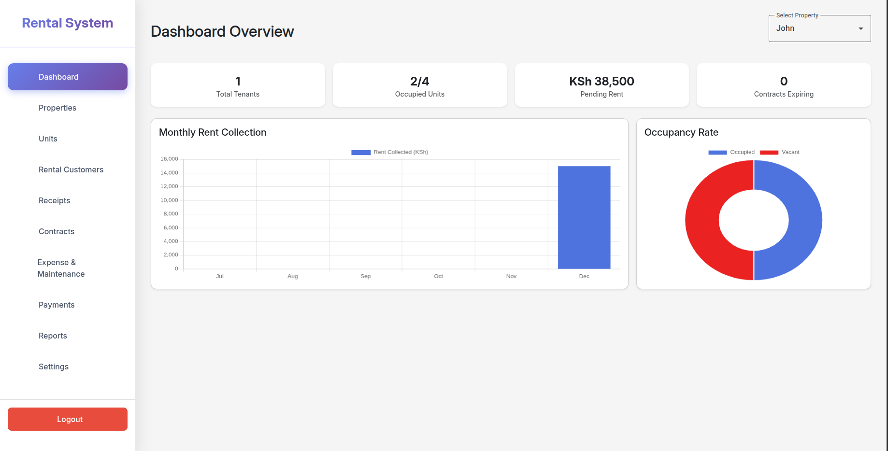
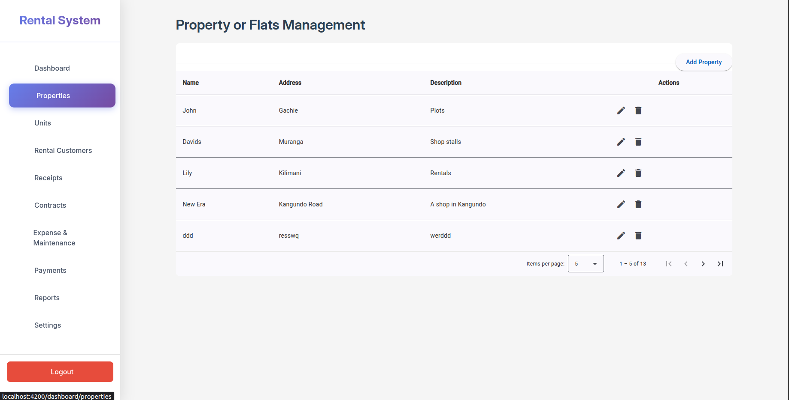
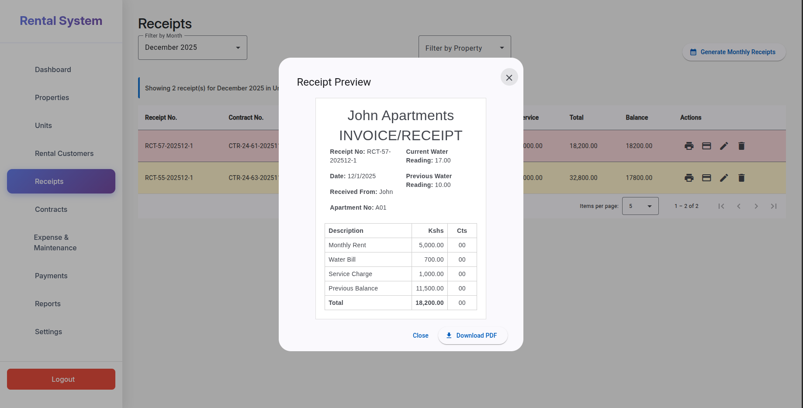
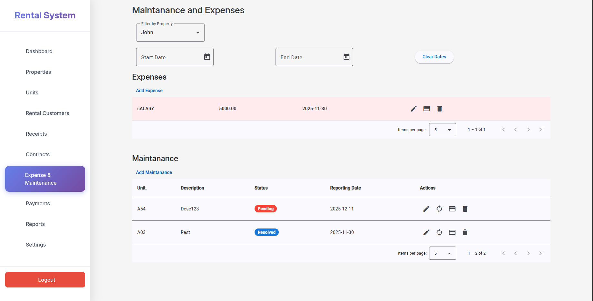

# Rental Management Frontend

React frontend for a rental management system.

## Project Overview

This project provides a web interface for managing properties, tenants, units, rent receipts, payments, and maintenance requests.

## Screenshots

### Dashboard


This has the summary of properies and payments they have happened with visual show

### Property Managment


Here you can add, Update, Delete a property or an Apartments

### Settings of Properties


Here allows users to set parameters eg, Rent deposit months, if water or electricty should be included in the system etc...

### Units Managment


Here allows you to add update or delete Units of a particular property and display units detail, also allows filtering via properties

### Invoice Generation


Allows one to generate invoice for a property

### Payment Tracking


Tracks Payment in and out of a property

### Maintance and Expenses Tracking


Tracks different maintanance and Expenses in a property


## Installation

Clone the repository:
```
git clone https://github.com/dennis027/rental-managment.git
cd rental-management-frontend
```

Install dependencies:
```
npm install
```

Create environment file:
```
cp .env.example .env
```

Update .env with your backend API URL:
```
REACT_APP_API_URL=http://localhost:8000/api
```

Start development server:
```
npm start
```

## Environment Variables

Create a .env file:
```
REACT_APP_API_URL=http://localhost:8000/api
REACT_APP_ENV=development
```

## Project Structure
```
src/
  components/
  pages/
  services/
  context/
  hooks/
  utils/
  assets/
public/
images/
```

## Usage

Default local URL:
```
http://localhost:3000
```

## Build for Production
```
npm run build
```

## Notes

Update API URL in .env before running the project.